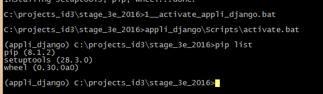

.. index::
   pair: Actions ; 13 octobre 2016
   

.. _13_octobre_2016:

=====================================================
Actions du 13 octobre 2016 : introduction à Python 3
=====================================================

.. contents::
   :depth: 3
   

Installation des prérequis
==========================
   
- installation de :ref:`Python 3.5 avec anaconda <installation_python_35>`
- installation de :ref:`gimp <installation_gimp>`
- écriture de :ref:`quelques programmes tirés de "Python pour les maths" <programmes_python>`
- installation du :ref:`module Python virtualenv <installation_virtualenv>`

.. _dev_web_django:

Début écriture d'une application Web Django
============================================

Création d'un environnement virtuel Python
-------------------------------------------

::

    virtualenv appli_django

Si on a un seul programme Python dans le PATH.

ou **préciser le chemin de l'interpréteur Python voulu au moyen de l'option --python=**::

    C:\projects_id3\stage_3e_2016>virtualenv appli_django --python=c:\python35\python.exe
    
::
    
    Already using interpreter c:\python35\python.exe
    Using base prefix 'c:\\python35'
    New python executable in C:\projects_id3\stage_3e_2016\appli_django\Scripts\python.exe
    Installing setuptools, pip, wheel...done.
    
    

Installation du framework Python Django
=========================================

.. seealso::

   - https://docs.djangoproject.com/fr/1.10/topics/install/#installing-official-release
   

Activation de l'environnement virtuel Python
--------------------------------------------

   
A la main::

    appli_django\Scripts\activate.bat
    
    
Avec un script ``1__activate_appli_django.bat``

Installation du framework Django
--------------------------------

.. seealso::

   - :ref:`installation_django`

Le framework Python doit être installé dans l'environnement virtuel 
précédemment créé

::

    pip install django
    
    
::

    Collecting django
      Using cached Django-1.10.2-py2.py3-none-any.whl
    Installing collected packages: django
    Successfully installed django-1.10.2    
        
        
::

    (appli_django) C:\projects_id3\stage_3e_2016>pip list

::

    Django (1.10.2)
    pip (8.1.2)
    setuptools (28.3.0)
    wheel (0.30.0a0)

        
