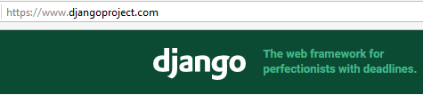

.. index::
   pair: Actions ; 14 octobre 2016
   pair: Django ; Tutorial
   pair: pip ; freeze
   

.. _14_octobre_2016:

===========================================================================
Actions du vendredi après-midi 14 octobre 2016 : suivre le tutorial Django
===========================================================================

.. seealso::

   - https://docs.djangoproject.com/fr/1.10/intro/tutorial01/
   - https://docs.djangoproject.com/fr/1.10/intro/tutorial02/

.. contents::
   :depth: 3

   

Installer git
=============

.. seealso::

   - :ref:`installation_git`
   
.. TODO:: à faire

Sauvegarde des modules utilisés
================================

.. seealso::

   - :ref:`env_virt`

.. TODO:: à faire

Sauvegarder les modules dans requirements.txt

::

    pip freeze > requirements.txt

Faire la documentation de ce qui a été vu avec sphinx
======================================================

.. seealso::

   - :ref:`env_sphinx35`

Un projet quel qu'il soit doit être accompagné d'une documentation.

Tutorial 1 de django : pas le temps ? 
=======================================

.. seealso::

   - https://docs.djangoproject.com/fr/1.10/intro/tutorial01/

Conclusion
===========

Par manque de temps, la partie développement d'application Web avec Django
n'a pas pu être abordée.

Seule la partie 'Python scientifique' a été abordé.

