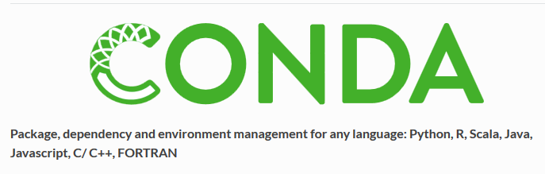

.. index::
   pair: Environnement virtuel ; Conda
   ! Conda
   

.. _conda:

=========================================================
Gestion d'environnements scientifiques Python avec conda
=========================================================

.. seealso::

   - http://conda.pydata.org/docs/
   - http://conda.pydata.org/docs/_downloads/conda-pip-virtualenv-translator.html
   
   
.. contents::
   :depth: 3

   

Conda
=====

.. seealso::

   - https://www.continuum.io/content/conda-data-science
   
   
**Conda** is an open source package management system and environment management 
system for installing multiple versions of software packages and their 
dependencies and switching easily between them. 

It works on Linux, OS X and Windows, and was created for Python programs but 
can package and distribute any software.

Conda is included in Anaconda and Miniconda. Conda is also included in the 
Continuum subscriptions of Anaconda, which provide on-site enterprise package 
and environment management for Python, R, Node.js, Java, and other application 
stacks. 

Conda is also available on pypi, although that approach may not be as up-to-date.

   
