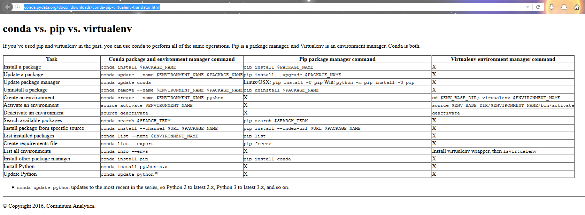

.. index::
   pair: Exercices ; nombres_x
   

.. _dev_classiques:

=============================================================
Développement de projets Python : scientifiques et classiques
=============================================================

.. seealso::

   - http://conda.pydata.org/docs/_downloads/conda-pip-virtualenv-translator.html
   
  

      

.. contents::
   :depth: 3

Types de projets Python
========================

On distingue 2 types de projet:

- les projets Python classiques 
- les projets Python "scientifiques"

Les projets Python classiques
==============================

Avec ces projets (comme un projet Django par exemple), on utilise:

- les environnements virtuels créés avec virtualenv 
- on installe les modules Python avec pip

Environnements virtuels "classiques" gérés avec pip et virtualenv
------------------------------------------------------------------

.. toctree::
   :maxdepth: 3
   
   virtualenvs/virtualenvs

Les projets Python "scientifiques"
===================================

Pour les projets scientiques on utilise les outils fournis par 
continuum:

- on utilise la commande 'conda' et non 'pip'

Environnements virtuels scientifiques
-------------------------------------

.. toctree::
   :maxdepth: 3
   
   conda/conda
   
   

