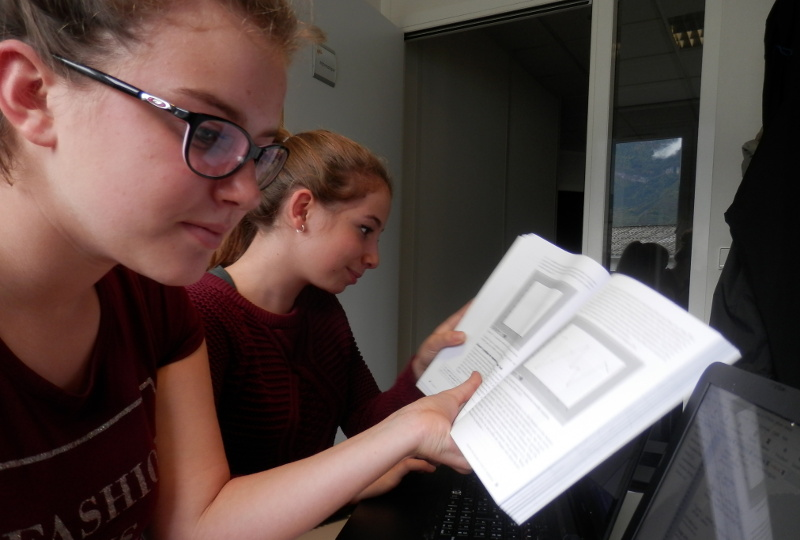

.. index::
   pair: Stage; 3e (2016-2017)

.. _stage_python:

========================================================================
Stage Python scientifique (3e 2016-2017)
========================================================================

.. seealso::

   - https://python-stage-3e-2016.readthedocs.io/en/latest/
   - https://www.python.org/
   - https://twitter.com/gvanrossum
   - https://docs.python.org/3/
   - https://twitter.com/PythonWeekly

.. sidebar:: Python scientifique

    :Projet: Stage 3e id3 Technologies
    :Release: |release|
    :Date: |today|
    :Authors: Anaelle, Sofia et Patrick
    
    - :ref:`genindex`
    - :ref:`search` 
    
    - https://docs.python.org/3/
    - https://www.continuum.io 
    - https://twitter.com/SciPyTip
    
      
.. figure::  installation/python35/Python_logo_and_wordmark.svg.png 
   :align: center  
    
Introduction
=============

Stage effectué par Anaelle et Sofia les 13 et 14 octobre 2016 pour une 
initiation au langage Python.

   

Programmes Python
=================

.. toctree::
   :maxdepth: 6
  
   programmes/programmes

Actions
========

.. toctree::
   :maxdepth: 4
  
   actions/actions

Environnements de développement Python
=======================================

.. toctree::
   :maxdepth: 5
   
   dev/dev

Installation de Python et autres outils
=======================================

.. toctree::
   :maxdepth: 5
   
   installation/installation

Glossaire
=========

.. toctree::
   :maxdepth: 5
   
   glossaire/glossaire
   
   

