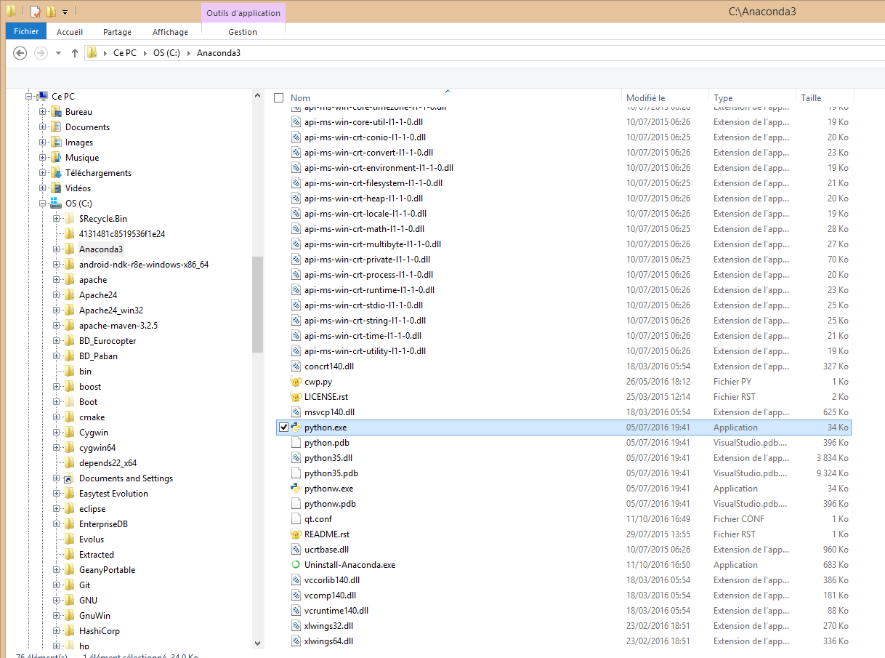
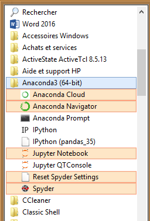

.. index::
   pair: Anaconda ; Python
   pair: Python ;  Scientifique
   ! Environnement scientifique
   ! Anaconda
   

.. _installation_anaconda:

============================================================
Installation de l'environnement scientifique Python Anaconda
============================================================

.. seealso::

   - https://www.continuum.io/downloads
   

.. contents::
   :depth: 3
   
   
Installation de `Python 3.5 64 bits` avec anaconda
===================================================    

   

Installation de l'environnement scientifique avec Anaconda_ 
(https://www.continuum.io/downloads)
   
   
.. _Anaconda: https://www.continuum.io/downloads   

Après installation
===================

L'interpréteur Python (python.exe) est sous le répertoire :file:`c:\anaconda3`

 

Un menu apparait dans les programmes disponibles
--------------------------------------------------  

      

IDEs disponibles
=================

.. seealso::

   - https://fr.wikipedia.org/wiki/Environnement_de_d%C3%A9veloppement
   

.. toctree::
   :maxdepth: 3
   
   spyder/spyder
   ipython/ipython
   jupyter_notebook/jupyter_notebook
   
   

 

