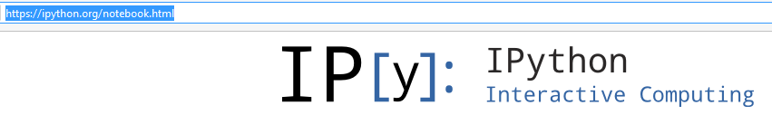
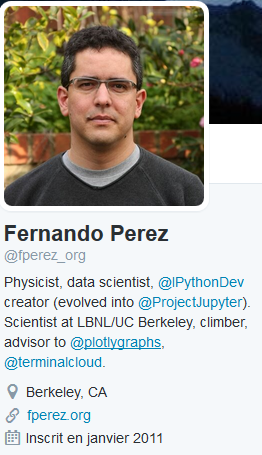

.. index::
   pair: Anaconda ; IPython
   pair: IDE ; IPython
   pair: Fernando Perez; IPython
   ! IPython
   

.. _ipython:

============================================================
IPython
============================================================

.. seealso::

   - http://ipython.readthedocs.io/en/stable/index.html
   - https://fr.wikipedia.org/wiki/IPython
   

   

Description
===========

IPython provides a rich toolkit to help you make the most out of using Python 
interactively. Its main components are:

- A powerful interactive Python shell
- A Jupyter kernel to work with Python code in Jupyter notebooks and other 
  interactive frontends.

Fernando Perez
==============

.. seealso:: 

   - https://twitter.com/fperez_org
   - https://en.wikipedia.org/wiki/Fernando_P%C3%A9rez_(software_developer)

Fernando Pérez is a physicist, software developer, and free software advocate. 

He is best known as the creator of the IPython programming environment, 
for which he received the 2012 Free Software Award from the Free Software 
Foundation. 

Fernando Pérez was born in Medellín, Colombia, and has a PhD in Particle 
Physics from University of Colorado Boulder, where he worked on numerical 
simulations in Lattice QCD. 

Pérez began working on IPython as a side project in 2001
   
