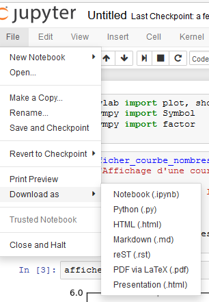
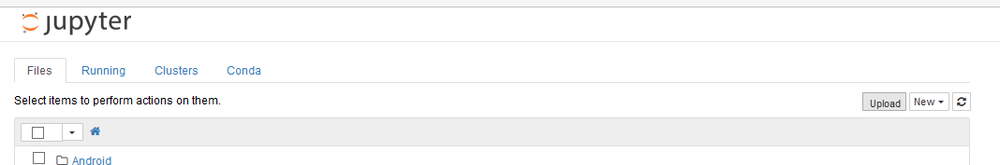

.. index::
   pair: Web ; Jupyter notebook
   pair: Notebook ; Jupyter
   pair: Sauvegarde ; Notebook
   ! Jupyter notebook
   ! Fernando Perez
   

.. _jupyter_notebook:

============================================================
Jupyter Notebook (anciennement IPython notebook)
============================================================

.. seealso::

   - http://jupyter.org/
   - https://twitter.com/ProjectJupyter
   - https://github.com/jupyter
   - http://ipython.readthedocs.io/en/stable/index.html
   

.. figure:: jupyter.png
   :align: center
   

.. contents::
   :depth: 3
   

Description
===========

.. warning:: The IPython Notebook is now known as the Jupyter Notebook. 

It is an interactive computational environment, in which you can combine 
code execution, rich text, mathematics, plots and rich media. 

Sauvegarde d'un notebook
========================

   
   
Chargement d'un notebook
=========================

   
   
   

