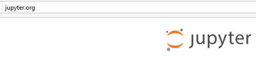

.. index::
   pair: Web ; Jupyter notebook
   pair: Notebook ; Jupyter
   ! Jupyter notebook
   

.. _jupyter_notebook:

============================================================
Jupyter Notebook (anciennement IPython notebook)
============================================================

.. seealso::

   - http://jupyter.org/
   - http://ipython.readthedocs.io/en/stable/index.html
   

   

.. contents::
   :depth: 3
   

Description
===========

.. warning:: The IPython Notebook is now known as the Jupyter Notebook. 

It is an interactive computational environment, in which you can combine 
code execution, rich text, mathematics, plots and rich media. 

