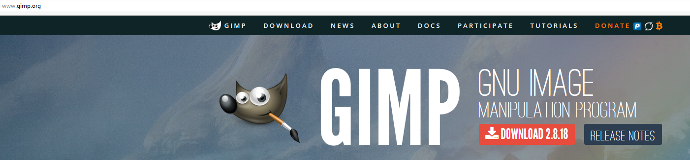
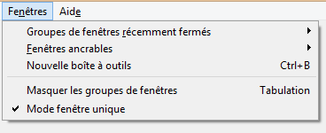

.. index::
   pair: Documentation ; GIMP
   

.. _installation_gimp:

=======================================================
Installation de GIMP ((GNU Image Manipulation Program)
=======================================================

.. seealso:: 

   - https://www.gimp.org/
   - https://fr.wikipedia.org/wiki/GIMP
   - http://docs.gimp.org/2.8/fr/

**GIMP** est utilisé pour capturer les images et les insérer dans les documents 
Sphinx.

   
