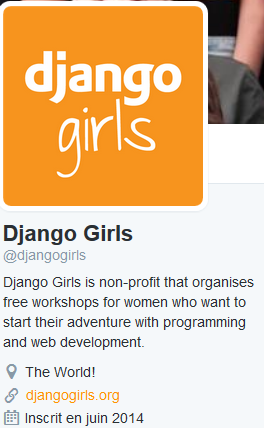
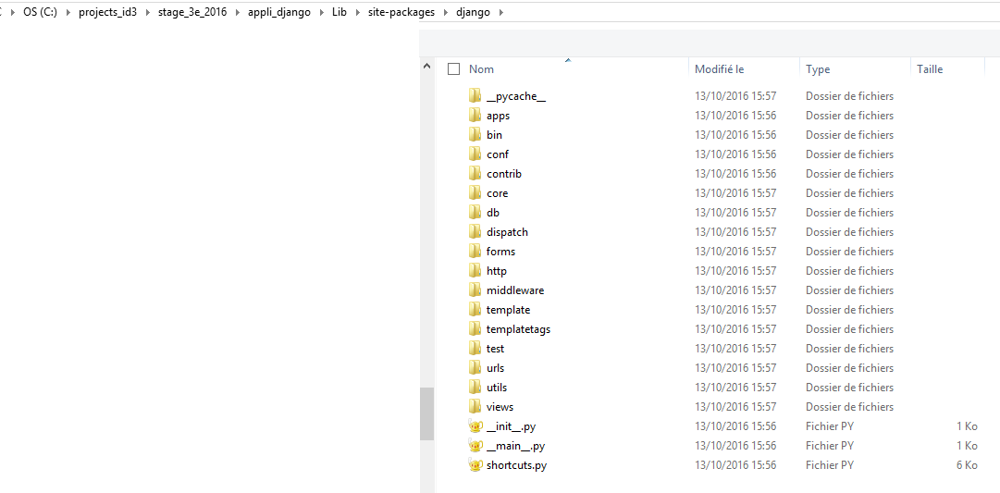

.. index::
   pair: Django ; Python
   pair: Django ; Girls
 

.. _installation_django:

=============================================
Installation du framework Python Django
=============================================

.. seealso:: 

   - https://docs.djangoproject.com/en/1.10/intro/tutorial01/
 
 
   
Au préalable
============

Se placer dans :ref:`l'environnement virtuel voulu <dev_web_django>`.   

Django girls
============

.. seealso:: 

   - https://twitter.com/djangogirls
   - https://djangogirls.org/
   

   
Django Girls is a non-profit organization and a community that empowers and 
helps women to organize free, one-day programming workshops by providing tools, 
resources and support. 

We are a volunteer run organization with hundreds of people contributing to 
bring more amazing women into the world of technology. 

We are making technology more approachable by creating resources designed 
with empathy.

During each of our events, 30-60 women build their first web application 
using HTML, CSS, Python and Django.  
 

Installation 
=============

::

    pip install django
    
    
Arborescence du framework Django installé
==========================================

Comme tous les modules Python, le framework django se trouve sous le répertoire :file:`Lib/site_packages`
de l'environnement virtuel **appli_django**.

   
   
Détail des fichiers
====================

Fichier produit au moyen de la commande::

    tree /a /f > django.txt
    
    
.. literalinclude:: django.txt
   :encoding: utf-8
   :linenos:
   
       
