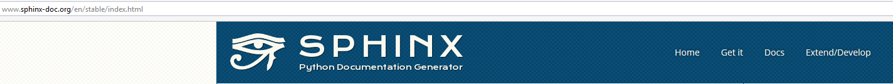

.. index::
   pair: Sphinx ; Python
   pair: Documentation ; GIMP
   pair: Eric Holscher; Documentation
   ! Eric Holscher
   

.. _installation_sphinx:

=====================================
Installation du module Python sphinx
=====================================

.. seealso:: 

   - http://www.sphinx-doc.org/en/stable/index.html
  

.. contents::
   :depth: 3
      

   

Description
============

Pour faire la documentation des projets Python, C, C++.

Pratiquement tous les projets Python utilisent sphinx pour leur documentation, 
à commencer par Python lui-même (https://docs.python.org/3/)

Autres
------

- http://docs.sympy.org/latest/index.html

Installation 
============

::

    pip install sphinx
    
  

Le format ReST
==============

.. toctree::
   :maxdepth: 3
   
   rest/rest  

    

Read the docs
=============

.. seealso::

   - https://readthedocs.org/
   - https://twitter.com/readthedocs
   
   

   
   
Read the Docs hosts documentation, making it fully searchable and easy to find. 
You can import your docs using any major version control system, including 
Mercurial, Git, Subversion, and Bazaar. We support webhooks so your docs get 
built when you commit code. There's also support for versioning so you can 
build docs from tags and branches of your code in your repository.

Hosting documentation is free and simple, read our guide to get started! 

Eric Holscher
-------------   

.. seealso::

   - https://twitter.com/ericholscher
   

   
   
   

