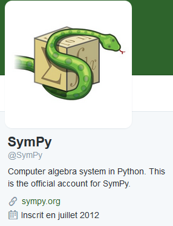

.. index::
   pair: Computer algebra system in Python; sympy
   ! sympy
   

.. _sympy:

============================================================
sympy (Computer algebra system in Python)
============================================================

.. seealso::

   - http://www.sympy.org/en/index.html
   - https://twitter.com/SymPy
   - http://nbviewer.jupyter.org/url/www.inp.nsk.su/%7Egrozin/python/sympy.ipynb
   

Description
===========

.. seealso::

   - http://docs.sympy.org/latest/install.html#anaconda
   

``sympy`` est l'un des nombreux modules Python installés avec anaconda3.

SymPy is a Python library for symbolic mathematics. It aims to become a 
full-featured computer algebra system (CAS) while keeping the code as 
simple as possible in order to be comprehensible and easily extensible. 

SymPy is written entirely in Python.
