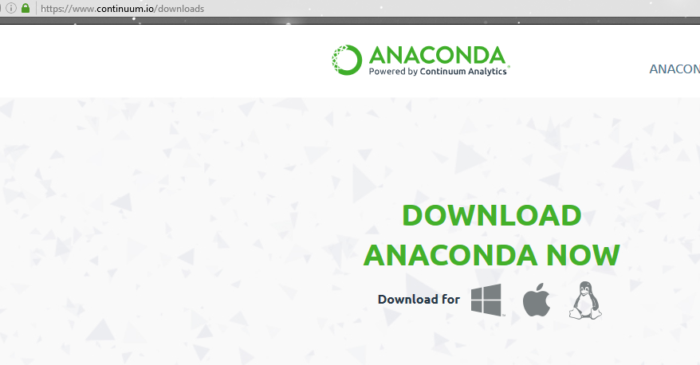
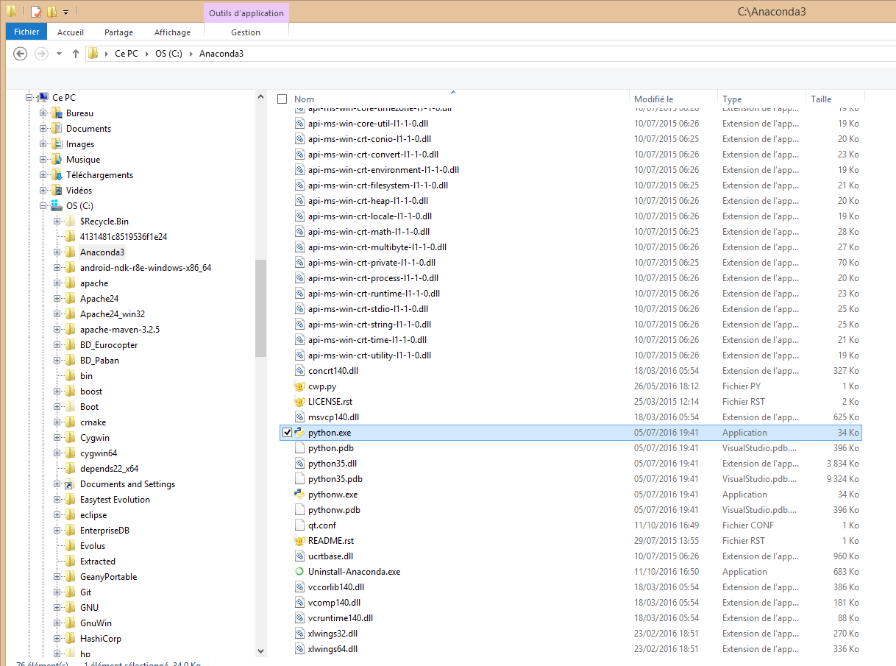
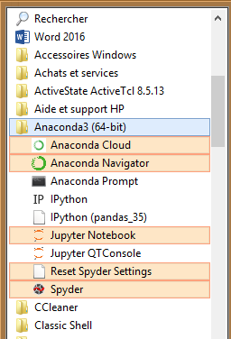

.. index::
   pair: Python 3.5 ; Python
   

.. _installation_python_35:

========================================
Installation de Python 3.5 avec Anaconda
========================================

.. seealso::

   - https://fr.wikipedia.org/wiki/Python_(langage)
   - https://docs.python.org/3/
   

.. contents::
   :depth: 3   
   
.. figure:: python.png
   :align: center
   
   
Installation de `Python 3.5 64 bits` avec anaconda
===================================================    
   

   

Installation de `Python 3.5 64 bits`_ avec anaconda_.
   
  
.. _anaconda: https://www.continuum.io/downloads
   
.. _`Python 3.5 64 bits`: https://docs.python.org/3/   

Après installation
===================

   

      
