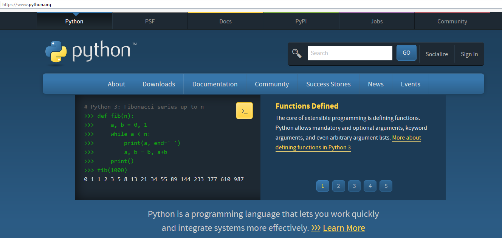
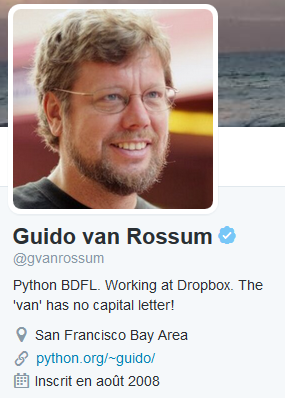

.. index::
   pair: Python 3.5 ; Python
   pair: Guido Van rossum ; Python
   

.. _installation_python_35:

========================================
Installation de Python 3.5 avec Anaconda
========================================

.. seealso::

   - https://fr.wikipedia.org/wiki/Python_(langage)
   - https://docs.python.org/3/
   

.. contents::
   :depth: 3   
   

   
   
Installation de `Python 3.5 64 bits` avec anaconda
===================================================    

.. seealso::

   - :ref:`installation_anaconda`
   - https://docs.python.org/3/
      

En installant Anaconda_ on installe Python 3.5 Installation de `Python 3.5 64 bits`_ 
(https://docs.python.org/3/) avec anaconda_ (https://www.continuum.io/downloads)
   
  
.. _Anaconda: https://www.continuum.io/downloads
   
.. _`Python 3.5 64 bits`: https://docs.python.org/3/   

Guido Van rossum
=================

.. seealso:: 

   - https://twitter.com/gvanrossum
   - https://fr.wikipedia.org/wiki/Guido_van_Rossum

   
   
Guido van Rossum est un développeur néerlandais, connu pour être le créateur et 
leader du projet du langage de programmation Python. 

Au sein de la communauté pythonienne, il est considéré comme un Benevolent 
Dictator for Life (« dictateur bienveillant à vie »), ce qui signifie qu'il 
continue à suivre le développement de Python et qu'il prend des décisions 
lorsque c'est nécessaire.

   

