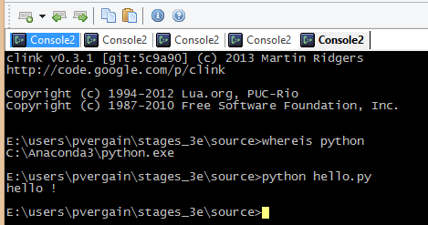

.. index::
   pair: Hello ; Python
   

.. _hello_world:

==========================
Hello World !
==========================

.. contents::
   :depth: 3

Programme 
==========

.. literalinclude:: ../../../source/hello/hello.py

Execution
===========

   
   

