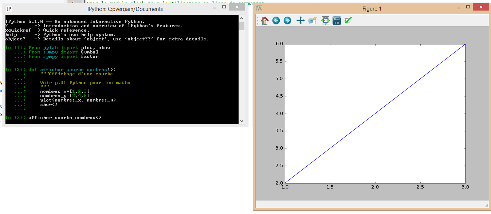

.. index::
   pair: Exercices ; matplotlib
   pair: Exercices ; sympy
   

.. _nombres_x_y:

========================================================
Code Python utilisant matplotlib et sympy
========================================================

.. seealso::

   - :ref:`matplotlib`
   - :ref:`sympy`

.. contents::
   :depth: 3

Prérequis : utiliser les IDEs Anaconda3
=========================================

.. seealso:: :ref:`prerequis_anaconda3`

Programmes (modules, scripts) Python
======================================

::

    C:\PROJECTS_ID3\STAGE_3E_2016\SOURCE
    +---hello
    |       hello.py
    |
    +---pylab
    |   \---exos
    |           exos.ipynb
    |           exo_factor.py
    |           exo_plot.py

Le module Python source/pylab/exos/exo_factor.py
--------------------------------------------------

.. literalinclude:: ../../../../source/pylab/exos/exo_factor.py
   :linenos:

Le module Python source/pylab/exos/exo_factor.py
-------------------------------------------------

.. literalinclude:: ../../../../source/pylab/exos/exo_factor.py
   :linenos:

Avec IPython (CLI, Command Line Interface)
===================================================

.. seealso::

   - :ref:`ipython`

   
   

Avec Jupyter notebook
=====================

.. seealso::

   - :ref:`jupyter_notebook`
   

.. figure:: avec_jupyter_notebook.png
   :align: center
   
   
Avec Spyder
=====================

.. seealso::

   - :ref:`spyder`
   

.. figure:: avec_spyder.png
   :align: center   
   
   
