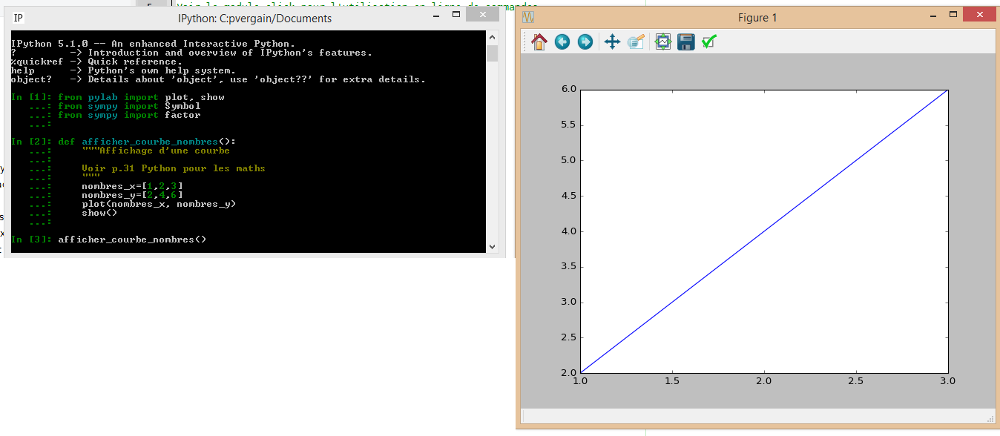
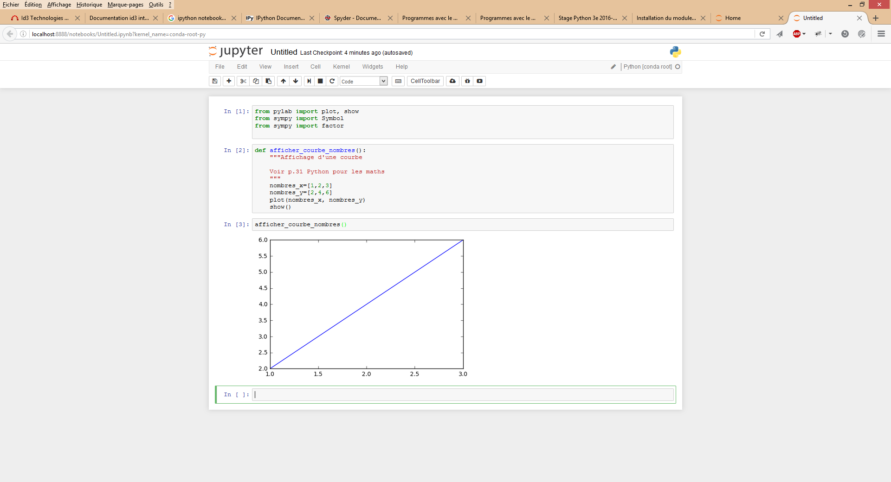
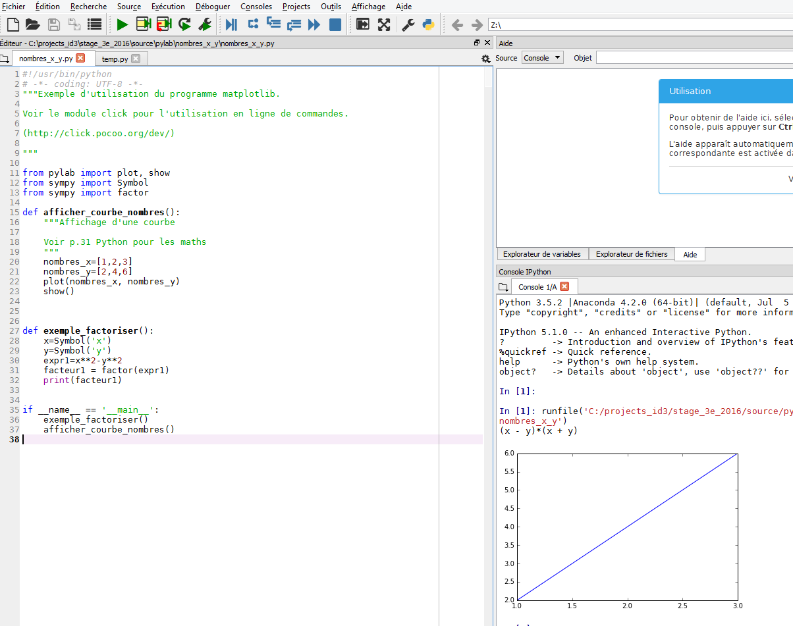

.. index::
   pair: Exercices ; nombres_x
   

.. _nombres_x_y:

==========================
Exercice nombres_x/y
==========================

.. contents::
   :depth: 3

Prérequis : utiliser les IDEs Anaconda3
=========================================

.. seealso:: :ref:`prerequis_anaconda3`

Programme Python
=================

.. literalinclude:: ../../../../source/pylab/nombres_x_y/nombres_x_y.py
   :linenos:

Avec IPython (CLI, Command Line Interface)
===================================================

.. seealso::

   - :ref:`ipython`

::

    In [1]: nombres_x=[1,2,3]

    In [2]: nombres_y=[2,4,6]

    In [3]: from pylab import plot, show

    In [4]: plot(nombres_x, nombres_y)
    Out[4]: [<matplotlib.lines.Line2D at 0x764b9936a0>]

    In [5]: show
    Out[5]: <function matplotlib.pyplot.show>

    In [6]: show()

   
   

Avec Jupyter notebook
=====================

.. seealso::

   - :ref:`jupyter_notebook`
   

   
   
Avec Spyder
=====================

.. seealso::

   - :ref:`spyder`
   

   
   
