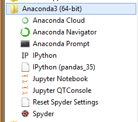
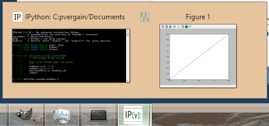

.. index::
   pair: Modules ; pylab
   pair: Environnement virtuel ; Anaconda3
   

.. _pylab:

================================
Programmes avec le module pylab
================================

.. seealso::

   - http://www.courspython.com/introduction-pylab.html   

.. contents::
   :depth: 3
   

.. _prerequis_anaconda3:

Prérequis : utiliser l'environnement virtuel Python Anaconda3
=============================================================

Se placer dans l'environnement Anaconda3 en choisissant 'IPython'.

Les programmes
==============

.. toctree::
   :maxdepth: 3
   
   exos/exos
